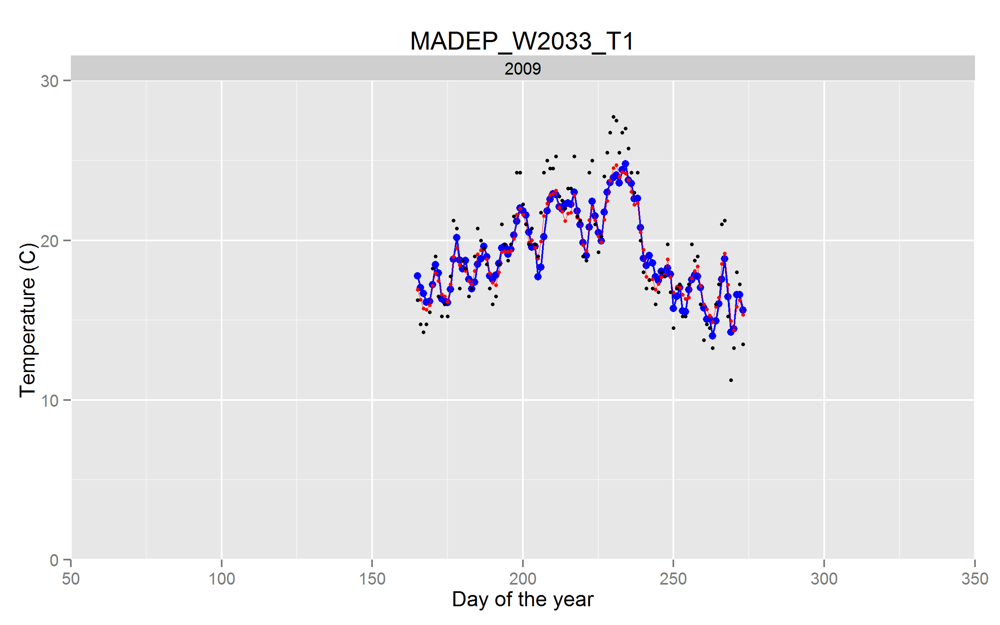

Catchy Title that Reviewers will Love
=====================================

### Daniel J. Hocking and Names of Awesome Coauthors

*Daniel J. Hocking ([dhocking@usgs.gov](mailto:dhocking@usgs.gov)), US Geological Survey, Conte Anadromous Fish Research Center, Turners Falls, MA, USA*

Abstract
--------

Set up the problem. Explain how you solve it. Tell what you find. Explain why it's the best thing ever.

Introduction
------------

Background and problem setup [@Hocking2014a; @Hocking2014]

Relevant literature [@Hocking2013; @Hocking2013f]

Objectives/hypotheses

Methods
-------

Describe what you did so it can actually be repeated. I don't want to see everything in the supplementary materials. Here's an example of using LaTeX to add equations:

$$
T_s = \mu + \frac{\alpha - \mu}{1 + e^{\gamma(\beta - T_a)}}
$$

Results
-------

Explain what you found. Avoid blind *P-values* (or avoid *P-values* altogether)

Discussion
----------

Give context to what you found. Relate it to previous work. Describe why it's the most important scientific finding of the decade, yet avoid hyperbole. Easy, right?

Acknowledgements
----------------
Thanks to Ethan White, Karthik Ram, Carl Boettiger, Ben Morris, and [Software Carpentry](http://software-carpentry.org/) for getting me started with the skills needed to [ditch MS Word](http://inundata.org/2012/12/04/how-to-ditch-word/) and produce more reproducible research.

Tables
------

Table 1: Example Markdown table

+--------------+-------+-----+---------+--------+------------+
|Name          |col2   |col3 |col4     |col5    |Comments    |
+==============+=======+=====+=========+========+============+
|Brook Trout   |1      |big  |few      |2.2     |Ecology &   |
|              |       |     |         |        |life history|
|              |       |     |         |        |data        |
|              |       |     |         |        |associated  |
|              |       |     |         |        |with trout  |
+--------------+-------+-----+---------+--------+------------+
|*Desmognathus*|100    |small|many     |0.3     |Widespread  |
|*fuscus*      |       |     |         |        |salamander  |
|              |       |     |         |        |species     |
+--------------+-------+-----+---------+--------+------------+

Figures
-------

Figure 1. Example of adding a figure.

Literature Cited
----------------

